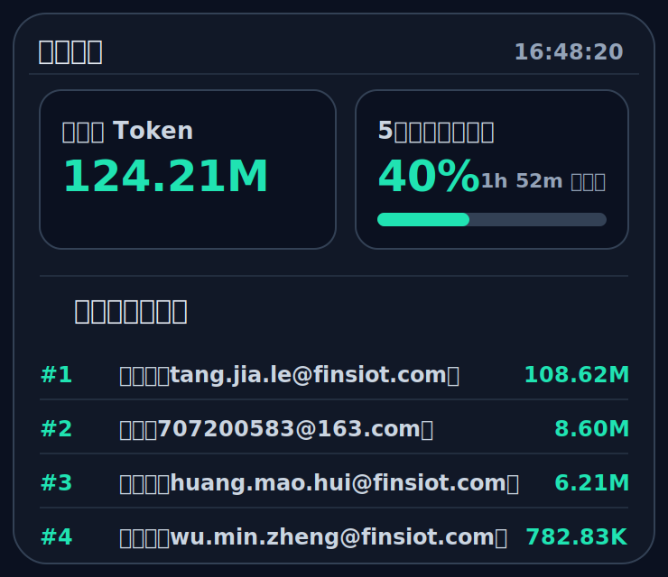
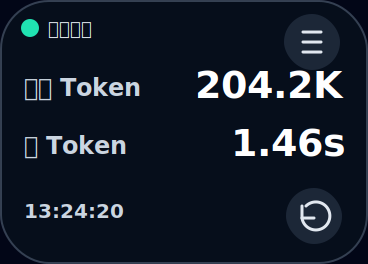
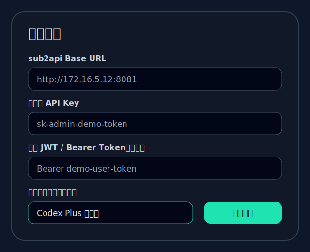
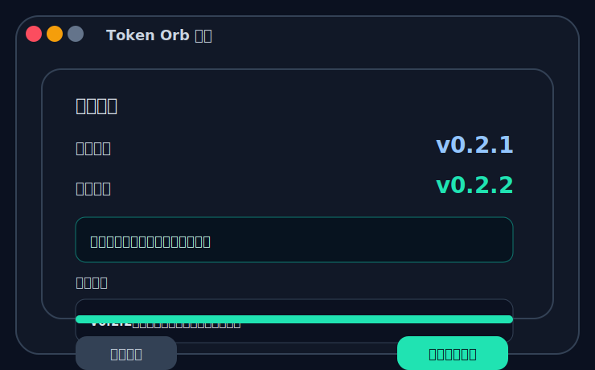

# Token Orb

Token Orb 是一个桌面悬浮监控球，用来查看 sub2api 的 Token 用量和管理员监控信息。

## 界面预览

以下截图使用模拟数据生成，仅用于展示插件界面效果。

### 平台监控面板



### 个人悬浮球



### 设置窗口



### 更新窗口



## 第一版能力

- 悬浮球显示个人数据：今日 Token、最新一条使用记录的首 Token 耗时。
- 配置管理员 API Key 后，显示系统监控列表：
  - 今日总 Token。
  - 5小时号池剩余量、最近刷新时间和 hover 刷新时间列表。
  - 今日用量榜：用户名/邮箱和 Token 数。
  - 号池账号数量：正常 / 限流中 / 错误 / 总数量。
  - 号池容量：当前并发容量 / 总并发容量。
- 管理员模式下仍可额外配置个人 Token，让悬浮球继续显示自己的个人数据。
- 未配置管理员 API Key 时，应用退回普通用户模式，只显示个人悬浮球数据。
- mac 优先交互：菜单栏图标常驻，左键显示/隐藏右上角监控面板，右键菜单打开设置。
- 监控面板默认固定到屏幕右上角，透明无边框，适合长期悬浮查看。
- 应用 Logo 位于 `public/logo.svg`，桌面图标位于 `src-tauri/icons/`。

## 数据来源

个人数据使用普通用户接口：

- `/api/v1/usage/dashboard/stats` 读取 `today_tokens`。
- `/api/v1/usage?page=1&page_size=1&sort=created_at&order=desc` 读取最新记录的 `first_token_ms`。

管理员数据使用管理员接口：

- `/api/v1/admin/dashboard/stats` 读取系统今日 Token。
- `/api/v1/admin/dashboard/users-ranking` 读取今日用户用量榜。
- `/api/v1/admin/groups/all` 读取 active 分组列表，用配置的分组名称完全匹配到分组 ID。
- `/api/v1/admin/accounts` 按匹配到的分组 ID 读取账号列表，并按 `extra.codex_5h_used_percent` 计算 5 小时号池剩余量。
- `/api/v1/admin/groups/capacity-summary` 按匹配到的分组 ID 读取 `concurrency_used` 和 `concurrency_max`。

5小时号池剩余量算法：配置分组名称后，先用分组名称完全相等匹配 active 分组 ID，再统计该分组下状态为 `active`、`rate_limited`、`overloaded` 一类可恢复账号，按 `100 - codex_5h_used_percent` 求平均值。错误或停用账号不参与计算。如果 5h 窗口已经过期，则该账号按已用 0%、剩余 100% 计算；界面同时显示这批参与计算账号里最近将要刷新的那个 5h 时间。鼠标移动到“后刷新”文字上，会按刷新时间从小到大展示正常账号和限流中账号的刷新时间列表。

账号数量算法：按当前号池分组统计总账号数量；分子拆分为正常、限流中、错误三类。暂停账号只计入总数量，不计入正常、限流中或错误。

## 配置说明

右键点击菜单栏 Token Orb 图标，选择“设置”，填写：

- `sub2api Base URL`：例如 `http://172.16.5.12:8081`。
- `管理员 API Key`：用于读取系统监控数据。配置后启用管理员模式。
- `个人 JWT / Bearer Token`：可选，用于悬浮球显示个人今日 Token 和首 Token。
- `号池分组名称`：可选，填写 sub2api 后台里看到的完整分组名称。名称必须完全一致，不做模糊匹配；留空时统计全部可恢复账号。
- `刷新间隔`：默认 30 秒，范围 10 到 300 秒。

配置保存在本机浏览器存储中，不会上传到其他服务。

## 菜单栏操作

- 左键点击菜单栏图标：显示或隐藏监控面板。
- 右键点击菜单栏图标：打开菜单，可进入设置或退出应用。
- “显示监控面板”：把监控面板固定到当前屏幕右上角。
- “设置”：打开独立设置窗口。

## 本地运行

安装依赖：

```bash
npm install
```

运行 Web 调试：

```bash
npm run dev
```

运行桌面应用：

```bash
npm run desktop
```

构建前端：

```bash
npm run build
```

运行测试：

```bash
npm test
```

## GitHub Release 自动打包

项目内置 GitHub Actions：`.github/workflows/release.yml`。

发版时只需要手动修改一个地方：`package.json`。

需要更新：

- `version`：应用版本号，不带 `v` 前缀，例如 `0.2.3`。
- `release.notes`：GitHub Release 中用户看到的更新记录。

修改后先同步 Tauri / Rust / npm 版本文件：

```bash
npm run release:sync
```

提交所有同步结果后，执行发布：

```bash
npm run release:tag
```

`release:tag` 会自动从 `package.json.version` 创建 `v*` tag，并使用
`package.json.release.notes` 作为 GitHub Release 更新记录。

脚本会自动检查：

- 当前分支必须是 `main`。
- 工作区必须没有未提交改动。
- 本地 tag 必须等于 `v` + `package.json.version`。
- 本地和 GitHub 远端不能已存在同名 tag。
- 会先推送 `main`，再创建 annotated tag 并推送到 GitHub。

GitHub Actions 也会再次校验 tag 与 `package.json.version` 是否一致，并确认
`package-lock.json`、`src-tauri/tauri.conf.json`、`src-tauri/Cargo.toml`、
`src-tauri/Cargo.lock` 已经同步提交，避免发布包内版本和 Release tag 不一致。

Action 会构建：

- macOS 通用安装包：`universal-apple-darwin`
- Windows 安装包
- Tauri updater 所需的更新包和 `latest.json`

### 自动更新签名配置

在线更新使用 Tauri updater，需要在 GitHub 仓库的 `Settings -> Secrets and variables -> Actions` 中配置：

- `TAURI_SIGNING_PRIVATE_KEY`：Tauri updater 私钥内容。
- `TAURI_SIGNING_PRIVATE_KEY_PASSWORD`：私钥密码。如果私钥没有密码，可以配置为空字符串或不配置。

当前应用内置的 updater 公钥位于 `src-tauri/tauri.conf.json` 的 `plugins.updater.pubkey`。如果重新生成私钥，必须同步替换该公钥，否则客户端无法验证 Release 更新包。

生成密钥命令：

```bash
npm run tauri -- signer generate --ci -w /tmp/token-orb-updater.key
```

生成后：

- `/tmp/token-orb-updater.key` 内容保存到 GitHub Secret `TAURI_SIGNING_PRIVATE_KEY`。
- `/tmp/token-orb-updater.key.pub` 内容写入 `src-tauri/tauri.conf.json`。

### 检查更新

右键菜单选择“检查更新”，会打开更新窗口：

- 展示当前版本。
- 如有新版，展示新版版本号和 Release 更新内容。
- 点击“立即更新”会下载并安装更新。
- 安装完成后点击“重启完成更新”。

## 当前注意事项

- 管理员 API Key 的实际认证头同时发送 `X-API-Key` 和 `Authorization: Bearer ...`，用于兼容不同部署方式。
- 如果 sub2api 后端没有在账号列表返回 `extra.codex_5h_used_percent`，5小时号池剩余量会显示 `--`。
- Tauri 桌面编译依赖 Rust；当前机器 Rust 版本是 `1.87.0`，项目已尽量锁定兼容依赖版本。
